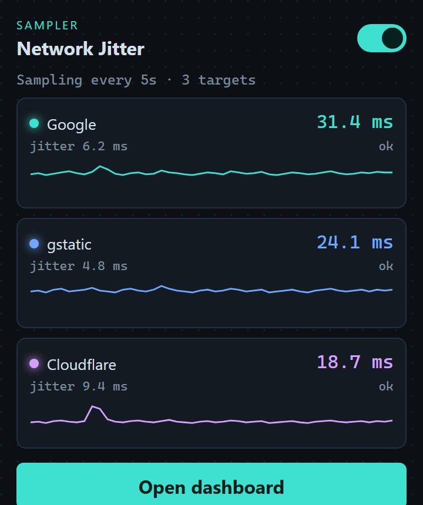
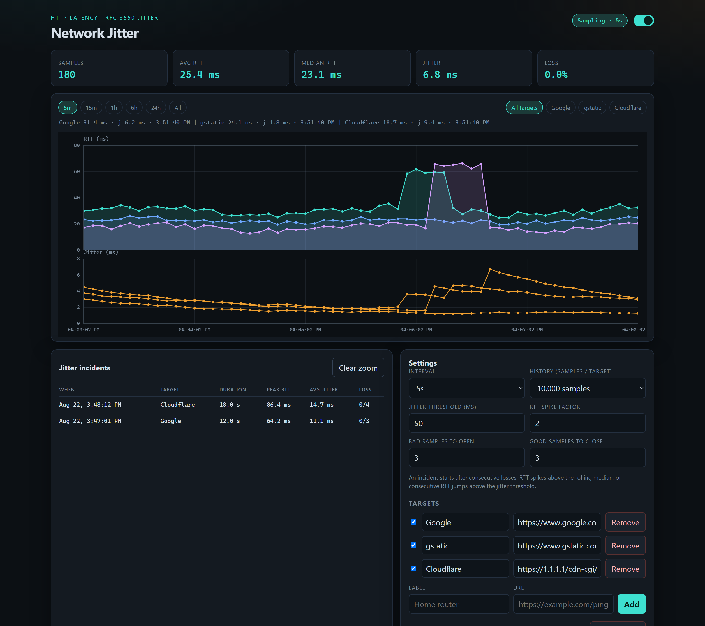

# Network Jitter

Chrome extension that samples **HTTP round-trip time (RTT)** to URLs you choose, graphs latency and RFC 3550-style jitter, and lists the times the network actually jittered.

Chrome cannot send ICMP pings, so each sample is an HTTP fetch to the target URL (start of the request until the response comes back).

## Screenshots

### Toolbar popup

Live RTT and jitter for each enabled target, plus a toggle to start or stop sampling.

### Dashboard

Charts, incident history, and settings in a full tab.

## Install

Chrome 116 or later.

1. Open `chrome://extensions`.
2. Turn on **Developer mode**.
3. Click **Load unpacked** and select this folder (the one that contains `manifest.json`).
4. Pin **Network Jitter** from the puzzle-piece menu.

The first time you start sampling, Chrome asks for permission to reach the ping URLs.

### Try it on another device

Chrome will not install a random `.crx` from outside the Web Store. Copy or zip this folder, send it to the other machine, and **Load unpacked** there the same way.

You only need the extension files: `manifest.json`, `background`, `dashboard`, `icons`, `lib`, `offscreen`, `popup`, and `shared`.

## Usage

1. Open the toolbar popup and turn sampling on (or use the toggle on the dashboard).
2. Click **Open dashboard** for charts, incidents, and settings.
3. Add or remove targets in **Settings**. Default targets are Google `generate_204`, gstatic `generate_204`, and Cloudflare `https://1.1.1.1/cdn-cgi/trace`.
4. Use the range chips (`5m` … `All`) to change the chart window. Incident rows follow that same window.

An incident opens after consecutive losses, RTT spikes above the rolling median, or consecutive RTT jumps above the jitter threshold.

## Permissions

- `storage`, `unlimitedStorage` — samples, incidents, and settings
- `alarms`, `offscreen` — keep the sample loop running while the popup is closed
- optional host access — only the URLs you enable as targets
